## Drift Data after 0 Epochs (Head)

### Drift Summary for `head`

| Comparison         | Mean Euclidean Drift | Standard Deviation |
|--------------------|----------------------|---------------------|
| **Δ₁ (237 vs 238)** | 0.376168             | 0.624860           |
| **Δ₂ (237 vs 239)** | 0.376168             | 0.624860           |
| **Δ₃ (238 vs 239)** | 0.000000             | 0.000000           |

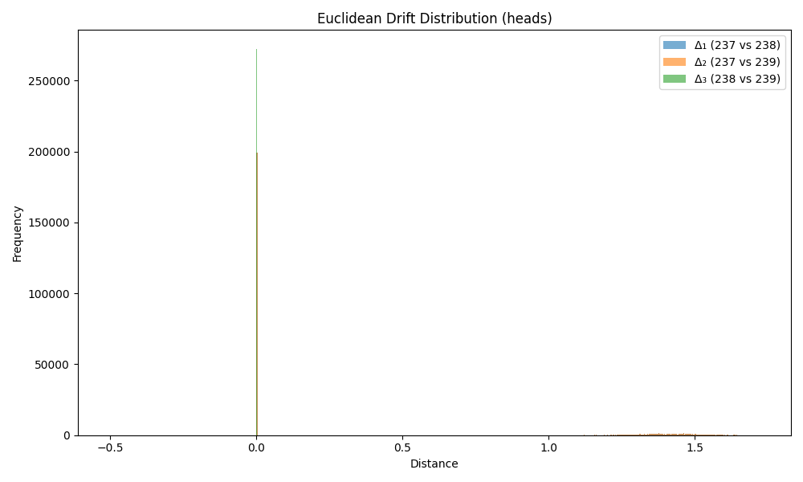

---

## Drift Data after 0 Epochs (Tail)

### Drift Summary for `tail`

| Comparison         | Mean Euclidean Drift | Standard Deviation |
|--------------------|----------------------|---------------------|
| **Δ₁ (237 vs 238)** | 0.369235             | 0.620644           |
| **Δ₂ (237 vs 239)** | 0.369235             | 0.620644           |
| **Δ₃ (238 vs 239)** | 0.000000             | 0.000000           |

---

## Drift Data after 0 Epochs (Relation)

### Drift Summary for `relation`

| Comparison         | Mean Euclidean Drift | Standard Deviation |
|--------------------|----------------------|---------------------|
| **Δ₁ (237 vs 238)** | 0.000000             | 0.000000           |
| **Δ₂ (237 vs 239)** | 0.000000             | 0.000000           |
| **Δ₃ (238 vs 239)** | 0.000000             | 0.000000           |

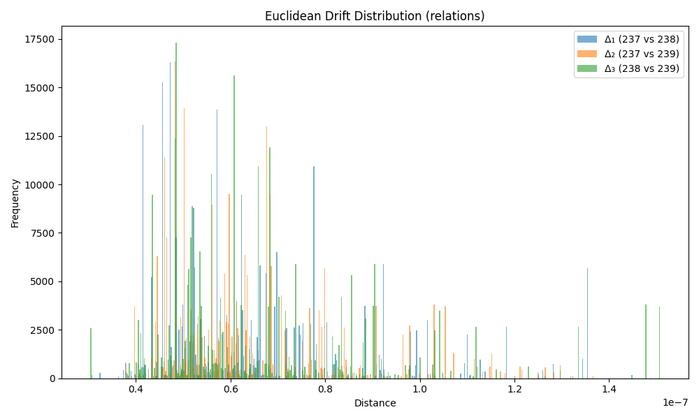

---

## Drift Data after 1 Epochs (Head)

### Drift Summary for `head`

| Comparison         | Mean Euclidean Drift | Standard Deviation |
|--------------------|----------------------|---------------------|
| **Δ₁ (237 vs 238)** | 0.548755             | 0.501207           |
| **Δ₂ (237 vs 239)** | 0.549280             | 0.501335           |
| **Δ₃ (238 vs 239)** | 0.237507             | 0.028535           |

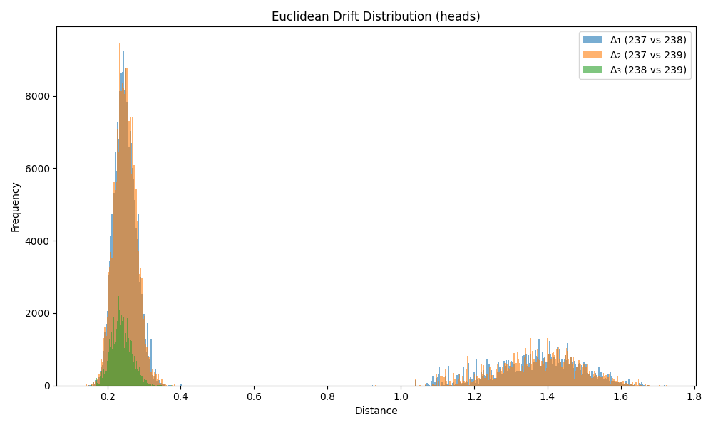

---

## Drift Data after 1 Epochs (Tail)

### Drift Summary for `tail`

| Comparison         | Mean Euclidean Drift | Standard Deviation |
|--------------------|----------------------|---------------------|
| **Δ₁ (237 vs 238)** | 0.532410             | 0.483982           |
| **Δ₂ (237 vs 239)** | 0.534347             | 0.484941           |
| **Δ₃ (238 vs 239)** | 0.234872             | 0.028699           |

---

## Drift Data after 1 Epochs (Relation)

### Drift Summary for `relation`

| Comparison         | Mean Euclidean Drift | Standard Deviation |
|--------------------|----------------------|---------------------|
| **Δ₁ (237 vs 238)** | 0.320820             | 0.084349           |
| **Δ₂ (237 vs 239)** | 0.324562             | 0.085230           |
| **Δ₃ (238 vs 239)** | 0.269317             | 0.036232           |

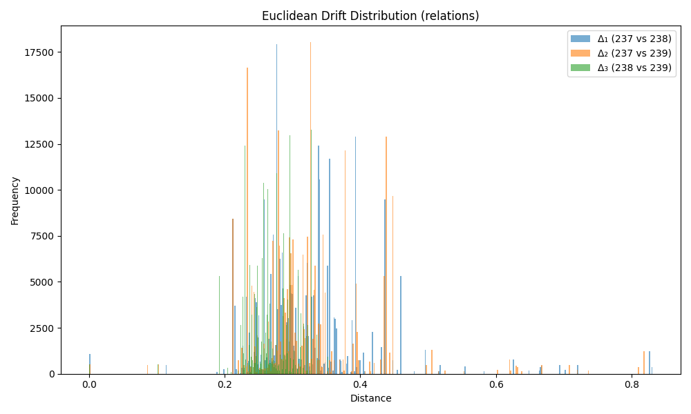

---

## Drift Data after 10 Epochs (Head)

### Drift Summary for `head`

| Comparison         | Mean Euclidean Drift | Standard Deviation |
|--------------------|----------------------|---------------------|
| **Δ₁ (237 vs 238)** | 0.745270             | 0.225862           |
| **Δ₂ (237 vs 239)** | 0.748099             | 0.224192           |
| **Δ₃ (238 vs 239)** | 0.560965             | 0.081191           |

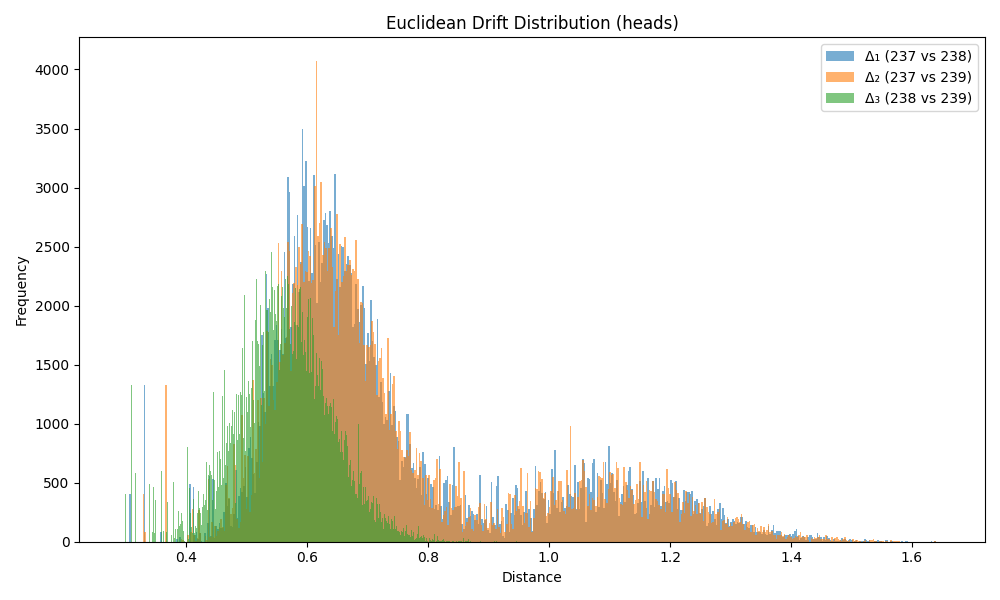

---

## Drift Data after 10 Epochs (Tail)

### Drift Summary for `tail`

| Comparison         | Mean Euclidean Drift | Standard Deviation |
|--------------------|----------------------|---------------------|
| **Δ₁ (237 vs 238)** | 0.700869             | 0.238187           |
| **Δ₂ (237 vs 239)** | 0.706011             | 0.237694           |
| **Δ₃ (238 vs 239)** | 0.524151             | 0.107459           |

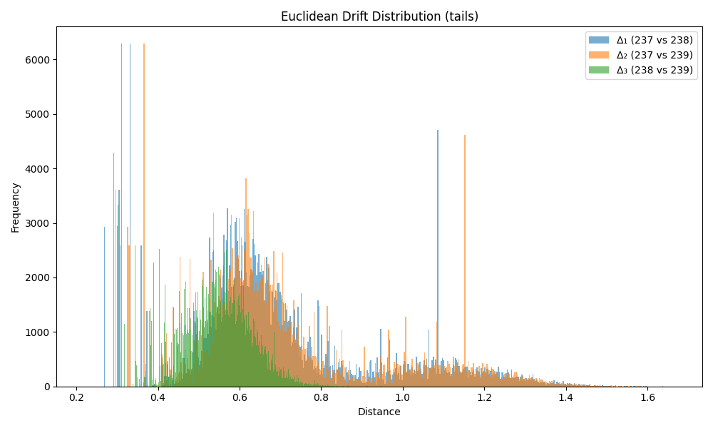

---

## Drift Data after 10 Epochs (Relation)

### Drift Summary for `relation`

| Comparison         | Mean Euclidean Drift | Standard Deviation |
|--------------------|----------------------|---------------------|
| **Δ₁ (237 vs 238)** | 0.573533             | 0.192627           |
| **Δ₂ (237 vs 239)** | 0.577169             | 0.191033           |
| **Δ₃ (238 vs 239)** | 0.451789             | 0.130354           |

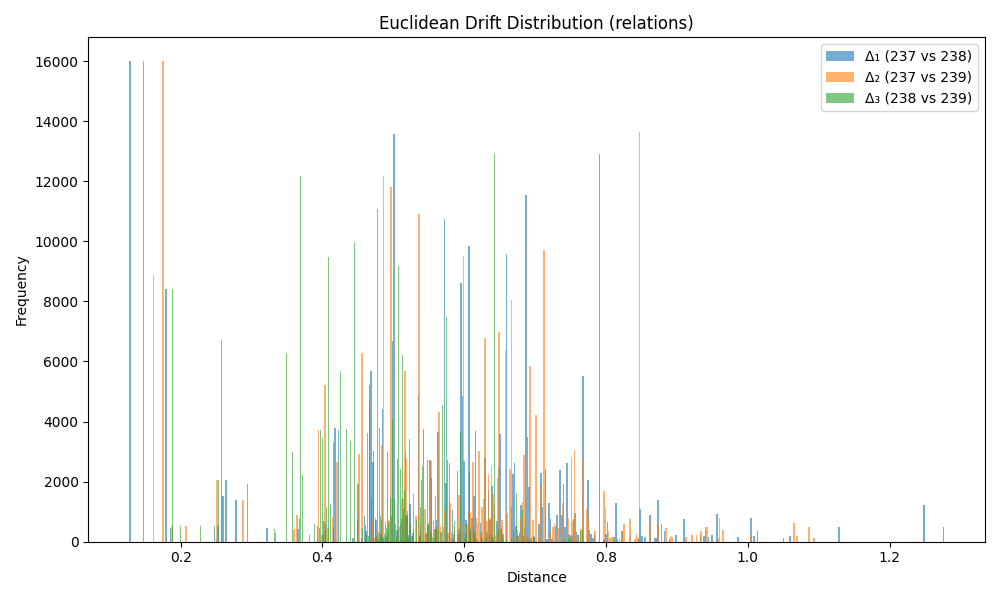

---

## Drift Data after 25 Epochs (Head)

### Drift Summary for `head`

| Comparison         | Mean Euclidean Drift | Standard Deviation |
|--------------------|----------------------|---------------------|
| **Δ₁ (237 vs 238)** | 0.824136             | 0.151941           |
| **Δ₂ (237 vs 239)** | 0.826599             | 0.151162           |
| **Δ₃ (238 vs 239)** | 0.701592             | 0.107184           |

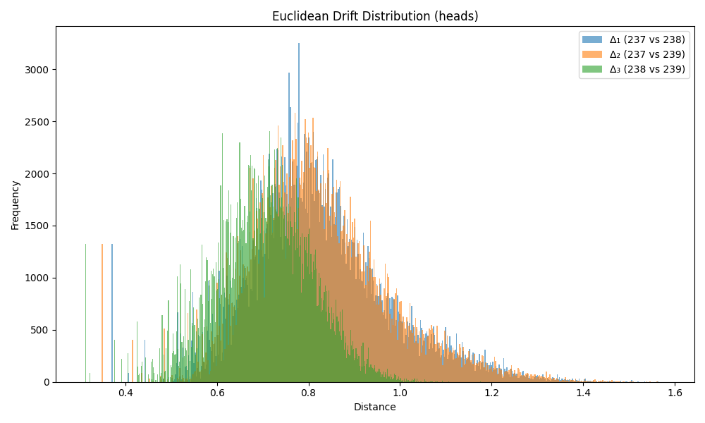

---

## Drift Data after 25 Epochs (Tail)

### Drift Summary for `tail`

| Comparison         | Mean Euclidean Drift | Standard Deviation |
|--------------------|----------------------|---------------------|
| **Δ₁ (237 vs 238)** | 0.773495             | 0.182581           |
| **Δ₂ (237 vs 239)** | 0.776617             | 0.185076           |
| **Δ₃ (238 vs 239)** | 0.648503             | 0.143170           |

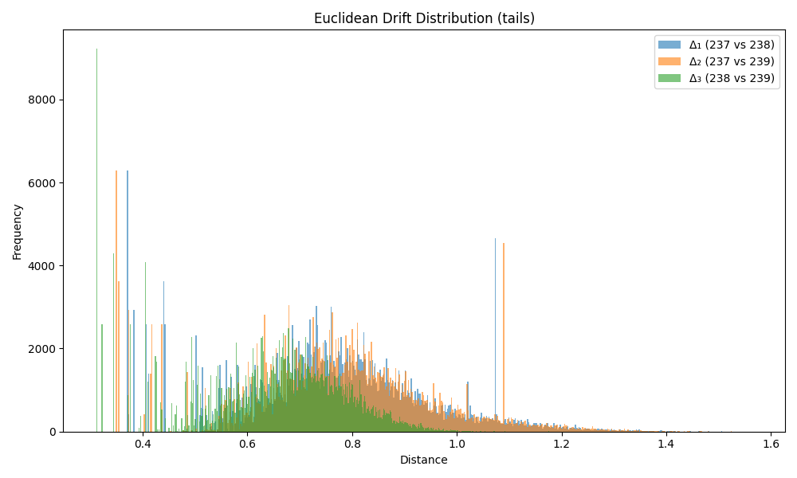

---

## Drift Data after 25 Epochs (Relation)

### Drift Summary for `relation`

| Comparison         | Mean Euclidean Drift | Standard Deviation |
|--------------------|----------------------|---------------------|
| **Δ₁ (237 vs 238)** | 0.662607             | 0.249711           |
| **Δ₂ (237 vs 239)** | 0.660335             | 0.248810           |
| **Δ₃ (238 vs 239)** | 0.563823             | 0.198440           |

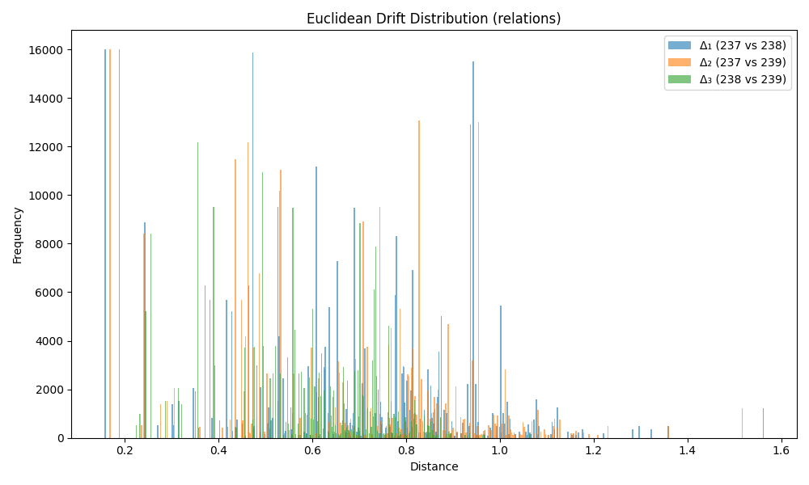

---

## Drift Data after 50 Epochs (Head)

### Drift Summary for `head`

| Comparison         | Mean Euclidean Drift | Standard Deviation |
|--------------------|----------------------|---------------------|
| **Δ₁ (237 vs 238)** | 0.866667             | 0.136976           |
| **Δ₂ (237 vs 239)** | 0.867281             | 0.135929           |
| **Δ₃ (238 vs 239)** | 0.770071             | 0.124259           |

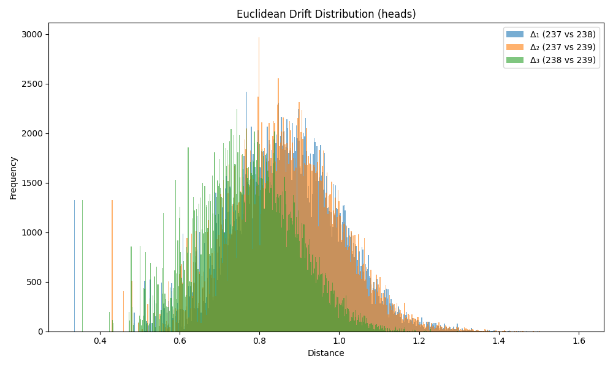

---

## Drift Data after 50 Epochs (Tail)

### Drift Summary for `tail`

| Comparison         | Mean Euclidean Drift | Standard Deviation |
|--------------------|----------------------|---------------------|
| **Δ₁ (237 vs 238)** | 0.816908             | 0.168594           |
| **Δ₂ (237 vs 239)** | 0.820152             | 0.166163           |
| **Δ₃ (238 vs 239)** | 0.718567             | 0.145012           |

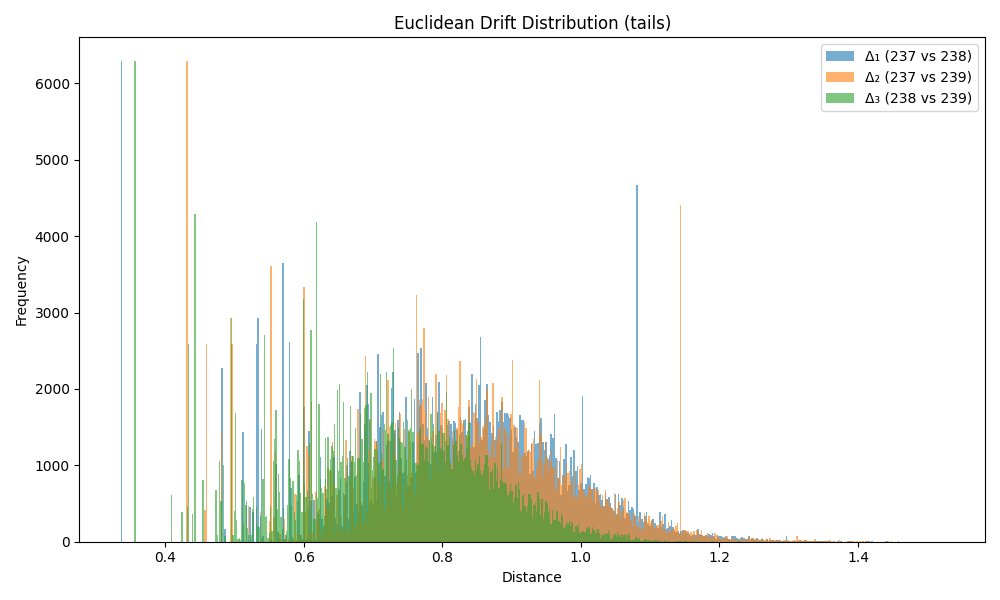

---

## Drift Data after 50 Epochs (Relation)

### Drift Summary for `relation`

| Comparison         | Mean Euclidean Drift | Standard Deviation |
|--------------------|----------------------|---------------------|
| **Δ₁ (237 vs 238)** | 0.743669             | 0.313210           |
| **Δ₂ (237 vs 239)** | 0.740452             | 0.312770           |
| **Δ₃ (238 vs 239)** | 0.640996             | 0.256797           |

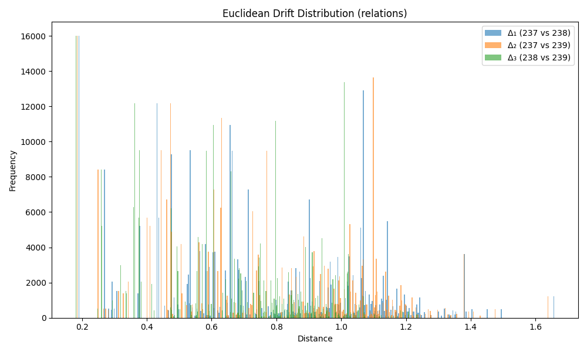

---

## Drift Data after 200 Epochs (Head)

### Drift Summary for `head`

| Comparison         | Mean Euclidean Drift | Standard Deviation |
|--------------------|----------------------|---------------------|
| **Δ₁ (237 vs 238)** | 0.932393             | 0.127591           |
| **Δ₂ (237 vs 239)** | 0.929965             | 0.127397           |
| **Δ₃ (238 vs 239)** | 0.849108             | 0.130508           |

---

## Drift Data after 200 Epochs (Tail)

### Drift Summary for `tail`

| Comparison         | Mean Euclidean Drift | Standard Deviation |
|--------------------|----------------------|---------------------|
| **Δ₁ (237 vs 238)** | 0.910897             | 0.151362           |
| **Δ₂ (237 vs 239)** | 0.905163             | 0.146783           |
| **Δ₃ (238 vs 239)** | 0.811965             | 0.144373           |

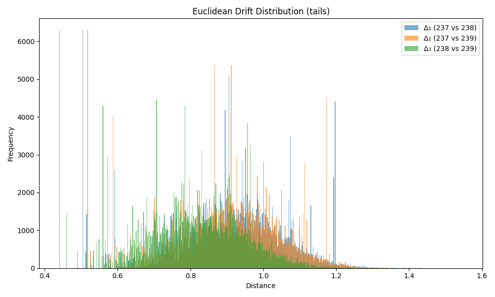

---

## Drift Data after 200 Epochs (Relation)

### Drift Summary for `relation`

| Comparison         | Mean Euclidean Drift | Standard Deviation |
|--------------------|----------------------|---------------------|
| **Δ₁ (237 vs 238)** | 1.013992             | 0.530235           |
| **Δ₂ (237 vs 239)** | 1.014604             | 0.507872           |
| **Δ₃ (238 vs 239)** | 0.896226             | 0.413012           |

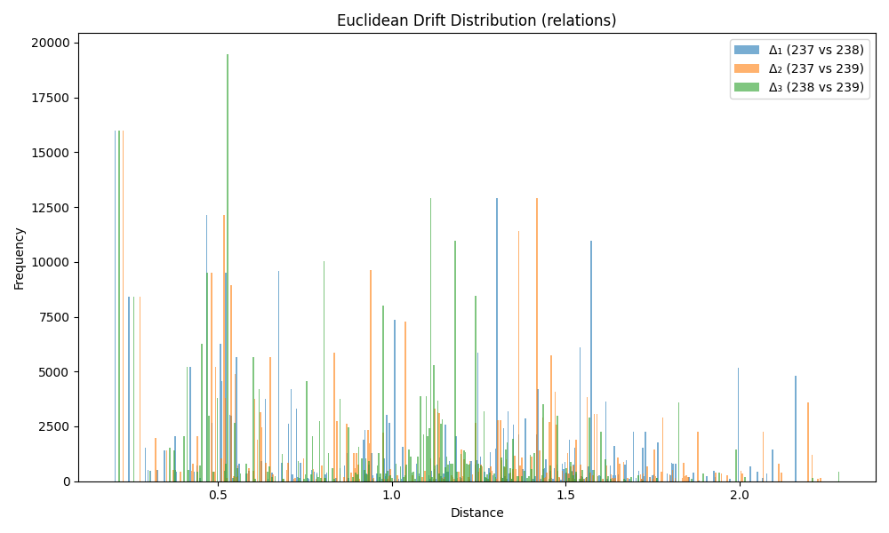

---

